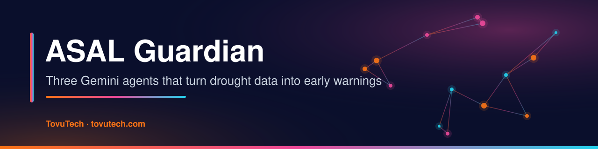
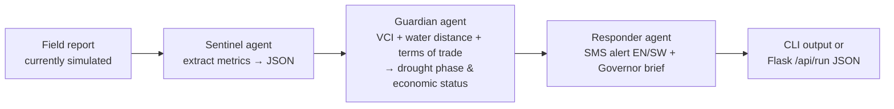

<p align="center">
  
  
  
  
  <a href="https://www.tovutech.com/projects/asal-guardian/"></a>
</p>

## What it is

**ASAL Guardian** is a multi-agent drought early-warning prototype for Garissa County, Kenya — part of Kenya's arid and semi-arid lands (ASALs). Drought bulletins are usually compiled monthly and turned into action slowly; this prototype shows how a chain of AI agents could read field indicators, classify the drought phase against NDMA-style thresholds and draft the alerts and briefs automatically.

It was built as a capstone for the Kaggle / Google **Agents Intensive** course (*Agents for Good* track). It currently runs on a **built-in, simulated field report** — no live data feeds are connected yet.

## What it does

- 📡 **Sentinel agent** (Gemini Flash) – reads a field report (vegetation condition index, distance to water, goat and maize prices) and extracts the metrics as JSON.
- 🧠 **Guardian agent** (Gemini Pro) – classifies the drought phase (*ALARM* if VCI < 20 or water distance > 10 km, *ALERT* for VCI 20–35, *NORMAL* above 35) and the economic status from terms of trade (goat price ÷ maize price: *CRISIS* < 30, *STRESSED* 30–50, *STABLE* > 50), with a one-line reason.
- 📣 **Responder agent** (Gemini Pro) – drafts a bilingual English/Kiswahili SMS alert (< 160 characters, starting "NDMA ALERT:") and a one-paragraph brief to the County Governor requesting activation of the drought contingency fund.
- 🔁 **Model fallback** – `get_available_model()` picks the first available model from a preference list (Gemini 2.5 → 1.5).
- 🌐 **Web view** – `app.py` (Flask) shows a page with a button that runs the workflow via `/api/run`, plus a `/health` check.
- 🩺 **Diagnostics** – `diagnostic.py` lists which Gemini models your key can use.
- 🎬 **Submission helpers** – `generate_images.py` and `generate_video.py` (needs ffmpeg) were used to produce competition media.

## How it works



The agents run sequentially because each one needs the previous agent's output. The thresholds live in the agents' instructions in `main.py`.

## Tech stack

| Area | Tools |
|---|---|
| Agents | Python, `google-generativeai` (Gemini 2.5 Flash / Pro with 1.5 fallback) |
| Web | Flask, Gunicorn (`Procfile`) |
| Config | `python-dotenv` |
| Media helpers | gTTS, Pillow, ffmpeg |

## Getting started

Requirements: Python 3.8+ and a Google AI Studio API key.

```bash
git clone https://github.com/jmsmuigai/ASAL_Guardian.git
cd ASAL_Guardian
./setup.sh                      # creates venv/ and installs requirements
cp .env.example .env            # then set GOOGLE_API_KEY=...
```

Run:

```bash
./run.sh                        # command-line workflow
./run_web.sh                    # web interface on http://localhost:8080
python diagnostic.py            # check which models your key can access
```

Deployment: the `Procfile` (`gunicorn ... app:app`, port from `$PORT`) works on buildpack-based hosts such as Google Cloud Run or Heroku. Set `GOOGLE_API_KEY` as a secret on the host — never in the code.

### Project structure

```
ASAL_Guardian/
├── main.py           # three agents + sequential workflow
├── app.py            # Flask web interface (/ , /api/run, /health)
├── diagnostic.py     # model availability check
├── generate_images.py, generate_video.py   # competition media helpers
├── requirements.txt, Procfile, setup.sh, run.sh, run_web.sh
└── FINAL_SUBMISSION.md   # Kaggle write-up
```

## Data & privacy

- The current input is a **hard-coded sample field report** (October 2025 style figures) inside `main.py`; outputs are illustrative.
- Two public drought bulletin PDFs (`report_june2024.pdf.pdf`, `report_oct2025.pdf`) are included as reference material.
- No personal data is collected or stored. The report text is sent to Google's Gemini API when the workflow runs.

## Status & roadmap

**Status:** working prototype / competition entry. Not deployed operationally and not endorsed by NDMA; thresholds are simplified from NDMA drought-phase concepts.

Possible next steps:
- Replace the simulated report with real inputs (e.g. VCI from satellite products, market price data, NDMA bulletins).
- Add validation of agent JSON outputs and tests.
- Send alerts through an SMS gateway after human review.

## Security

See [SECURITY.md](SECURITY.md). The API key is loaded from `.env` / environment variables only.

## Acknowledgments

- National Drought Management Authority (NDMA) for the drought-phase concepts the thresholds are based on
- Kaggle and Google for the Agents Intensive course
- The pastoralist communities of Garissa County

---

<p align="center">
  <b>Built by James M. Mburu · TovuTech Limited</b><br>
  <a href="https://www.tovutech.com">https://www.tovutech.com</a> · <a href="mailto:intelligence@tovutech.com">intelligence@tovutech.com</a><br>
  📖 Case study: <a href="https://www.tovutech.com/projects/asal-guardian/">tovutech.com/projects/asal-guardian</a>
</p>
